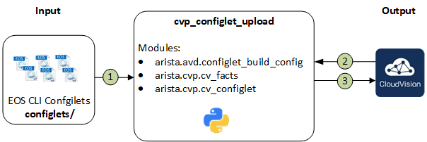

# Ansible Role: cvp_configlet_upload

**Table of Contents:**

- [Ansible Role: cvp_configlet_upload](#ansible-role-cvp_configlet_upload)
  - [Overview](#overview)
  - [Role requirements](#role-requirements)
  - [Role Inputs and Outputs](#role-inputs-and-outputs)
    - [Inputs](#inputs)
      - [Inventory configuration](#inventory-configuration)
      - [Module variables](#module-variables)
      - [Outputs](#outputs)
    - [Tasks](#tasks)
  - [Requirements](#requirements)
  - [License](#license)

## Overview

**cvp_configlet_upload**, is a role that deploys configlets stored in a local folder to Cloudvision server.

## Role requirements

This role requires to install `arista.cvp` collection to support CloudVision interactions.

```shell
$ ansible-galaxy collection install arista.cvp
```

## Role Inputs and Outputs

Figure 1 below provides a visualization of the roles inputs, outputs and tasks in order executed by the role.



1. Read content of `{{ configlet_directory }}` and create **cv_configlet** input structure.
2. Collect Cloudvision facts.
3. Create or update configlets on Cloudvision server with content from `{{ configlet_directory }}`

### Inputs

#### Inventory configuration

An entry must be part of the inventory to describe CloudVision server. `arista.cvp` modules use httpapi approach. Example below provides framework to use in your inventory.

```yaml
all:
  children:
    cloudvision:
      hosts:
        cv_server01:
          ansible_httpapi_host: 10.83.28.164
          ansible_host: 10.83.28.164
          ansible_user: ansible
          ansible_password: ansible
          ansible_connection: httpapi
          ansible_httpapi_use_ssl: True
          ansible_httpapi_validate_certs: False
          ansible_network_os: eos
          ansible_httpapi_port: 443
          # Configuration to get Virtual Env information
          ansible_python_interpreter: $(which python3)
```

For complete list of authentication options available with Cloudvision Ansible collection, you can read dedicated page on [arista.cvp collection](https://cvp.avd.sh/en/latest/docs/how-to/cvp-authentication/).

#### Module variables

- __`configlet_directory`__: Folder where local configlets are stored. Default: `configlets`.
- __`file_extension`__: File extension to look for configlet in their local folder. Default: `conf`.
- __`configlets_cvp_prefix`__: Prefix to use for configlet on CV side. Default: _Not set_ and it is required.
- __`execute_tasks`__:  `true` / `false`. Support automatically excuting pending tasks. Default: `false`.
- __`cv_collection`__: Version of Cloudvision collection to use. Can be `v1` or `v3`. Default is `v1`.

_Example_:

```yaml
tasks:
  - name: upload cvp configlets
    import_role:
        name: arista.avd.cvp_configlet_upload
    vars:
      configlet_directory: 'configlets/'
      file_extension: 'txt'
      configlets_cvp_prefix: 'DC1-AVD'
      execute_tasks: false
      cv_collection: v1
```

This module also supports tags to run a subset of ansible tasks:

- __`build`__: Generate `cv_configlet` input structure.
- __`provision`__: Run `build` tags + configure Cloudvision with information generated in previous tasks

```shell
$ ansible-playbook playbook.to.deploy.with.cvp.yml --tags "provision"
```

#### Outputs

- None.

### Tasks

1. Read content of `{{ configlet_directory }}` and create **cv_configlet** input structure.
2. Collect Cloudvision facts.
3. Create or update configlets on Cloudvision server with content from `{{ configlet_directory }}`

## Requirements

Requirements are located here: [avd-requirements](../../README.md#Requirements)

## License

Project is published under [Apache 2.0 License](../../LICENSE)
